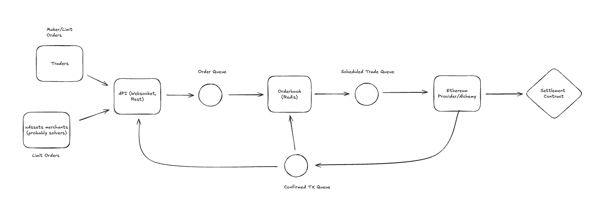

I initially wanted to mostly focus on the orderbook but implemented a few other things (queue, executor contract) - mostly to make sure the system as a whole somewhat makes sense. However, lots of edge cases/details are missing due to lack of time.

## Architecture

- This is a PoC for a decentralized exchange with an off-chain orderbook and on-chain settlement.
- Order makers/takers sign orders and send them to the API (not implemented). Orders are routed through a queue, and added/matched in an offchain orderbook. If orders are matched, valid and simulation succeeds, the trade is finalized through a settlement contract.
- For better UX, orders can be cancelled off-chain but that requires trusting the exchange (us) to not send the order until the order deadline (part of signature) has passed. Alternatively, orders could be cancelled on-chain (not implemented). With this system solvers/uAssets merchants to continuously update their quotes without paying fees.
- This exchange can be deployed on EVM chains. In particular, each asset/chain would have it's own orderbook (this is not the case in the current implementation). But only on settlement contract per chain is needed.
- Communication between server and client is not implemented. Could/should be done in REST, Websockets, Push-notifications.

## Diagram



This is a very simplified diagram.

## High level overview of the different components:

**Off-chain Orderbook**: The orderbook is managed and stored with Redis. There's probably a lot of edge cases and errors in the current implementation, i haven't time to test on non-trivial orders. 
* Currently only supports limit and market orders. 
* Price-time priority is implemented. 
* There's probably a lot of edge cases and errors in the current implementation, i haven't time to test on non-trivial order sequences.
* Different key sets for different purposes: open orders, filled orders, cancelled orders, inflight orders. 

**Queue System**: I initially thought of using RabbitMQ for orchestrating messages through the system. I ended up using Bull due to ease of implementation (including type safety). Rabbit or other might be better for production. Bull (or any similar queue) helps with order priority, handling potential burst loads and also persistence/recovery.
* Order queue: Adds or matches orders in the orderbook. Matched orders whose simulation succeeds are added to the scheduled trade queue.
* Scheduled trades queue: Orders that are matched but not yet confirmed by the settlement contract are added to the pending queue.
* Confirmed Transactions queue: Trade that have been confirmed are routed through this queue.

**On-chain Settlement**: For the sake of testing, I wrote a dummy settlement contract that simulates deposits, withdrawals and trades. It misses verifying signatures and is very simplistic. Currently, the fee system is not implemented but one can easily implement a system via paymaster or taking a percentage of the trade.

**Other**: 
- zod for schema validation
- ethers/typechain/hardhat for type-safe contracts
- see integration folder for integration tests (also need to be improved)


## Prerequisites

- Node, Redis (you can use the docker-compose)

## How to use 

- Currently, i've only tested the codebase through integration tests 

```bash
npm run test
```

or 

```bash
npm run test:quiet
```

## Environment Variables

```env
SETTLEMENT_CONTRACT_ADDRESS=0x...  # Deployed settlement contract address
RPC_URL=                          # Ethereum node RPC URL
REDIS_URL=                        # Redis connection URL
```

## Installation

```bash
# Install dependencies
npm install

# Compile contracts
npm run compile

# Run tests
npm test
```